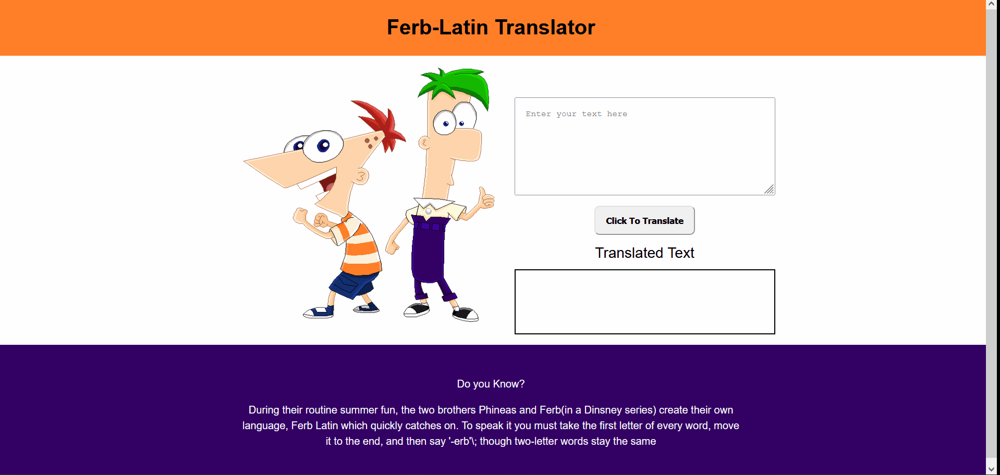

# Ferb-latin Translator

Ferb-latin translator app convert English language into ferb-latin spoken by the two brothers Phineas and Ferb(in a Dinsney series)

## Table of contents

- [Overview](#overview)
  - [Screenshot](#screenshot)
  - [Links](#links)
- [My process](#my-process)
  - [Built with](#built-with)
  - [What I learned](#what-i-learned)
- [Author](#author)

## Overview

### Screenshot



### Links

- [View live](https://translateintoferblatin.netlify.app/)

## My process

### Built with

- Semantic HTML5 markup
- [Sass](https://sass-lang.com/) - CSS extension language
- CSS Grid
- CSS Flexbox
- Vanilla JavaScript

### What I learned

1. Working with API - In this project I used the [funtranslations.com](https://funtranslations.com/) to convert English into ferb-latin language

2. How to make request using `fetch()` API and then manipulate the received data.

A general syntax of `fetch()` method is

```js
fetch("http://example.com/movies.json")
  .then((response) => response.json())
  .then((data) => console.log(data));
```

## Author

- Twitter - [@junaidshaikh_js](https://twitter.com/junaidshaikh_js)
- Linkedin - [@junaidshaikhjs](https://www.linkedin.com/in/junaidshaikhjs/)
